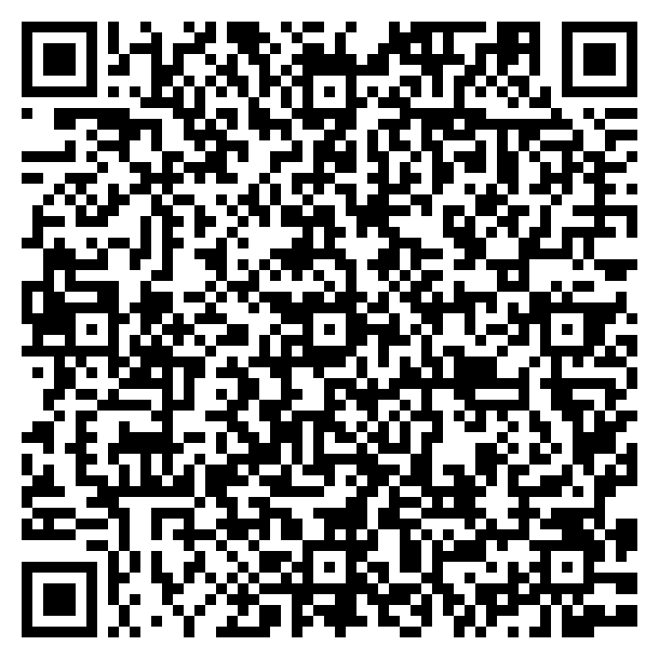

## Disclosure is not documentation

*"ChatGPT was used for data analysis."*

- A sentence like that tells a reviewer that a tool was used, and nothing about whether the use was sound.
- The reader who wants to reproduce or build on the work has no prompts, no outputs, and no record of what the researcher kept or discarded.
- Prompts and outputs are part of the method, and deserve the same treatment as code and data.

::: {.notes}
Most journals now require a sentence like this. Some medical journals ask for it in the methodology. Very few ask anyone to show their work. Disclosure is not an acknowledgement, because the model is not a person being thanked. It is not a citation, because the model is not an authority. It is a sentence that says a tool was used.

The reviewer reading it has to decide whether to trust the result. The editor has to decide whether to publish. A librarian has to teach students how to check a source. None of them can do that from one sentence. The overwhelming majority of readers will never look at the prompts. When something goes wrong and someone needs the provenance of one aspect of a paper, the logs should exist, in the same way that published data lets a reader find out whether the formula was dragged all the way down the column.

The outputs on their own are the least interesting part. The inputs lead to the outputs, and the inputs are what a researcher can be judged on. A model is remarkably consistent for a given release. The words differ, the sense of the answer holds, so a record of the interaction supports judgement and reuse even where exact reproduction is not the goal.

We publish data and code so that someone can look and judge whether what was done was appropriate. The same intuition applies to the prompts and the interaction record. The person who benefits most from this discipline is the researcher who kept the record, who can go back to a prompt that worked. Peer reviewers who care are the second-order beneficiaries.
:::

## Policy already requires documentation of AI use

*No standard says what the record should contain*

- COPE, ICMJE, and the major publishers require authors to declare and describe generative AI use. ICMJE asks for that description in the Methods section.
- None of those policies states what the description should contain or in what form.
- The systematic review behind the CHART reporting guideline examined 137 chatbot health studies. One fully described the model version it evaluated.

::: {.notes}
COPE's guidance is cross-domain by design, and ICMJE's norms are applied well beyond medicine. Springer Nature and Elsevier, with many journals and universities, now set expectations for declaring generative AI use. ICMJE goes furthest. Its Recommendations ask authors to describe in the Methods section how AI was used for data collection, analysis, or figure generation. The European Commission's living guidelines (third version, May 2026) tell researchers to remain transparent and aim for reproducibility.

Existing policy tells researchers what to declare. It does not define what the documentation must contain, or in what form a machine could read it. That is a specification gap rather than a policy gap. Adding another requirement to disclose would not close it.

Huo and colleagues, JAMA Network Open, reviewed 137 studies of chatbot health advice published to October 2023. Thirty-six described none of the characteristics of the model they evaluated. One described the model version fully. None described the model comprehensively. Their own conclusion was that without full knowledge of the intervention being applied, it is difficult to interpret the model's performance. Bibliometric analysis of publisher instructions to authors (Ganjavi and colleagues, BMJ, 2024) found wide inconsistency in what disclosure is required, where it should appear, and at what level of detail.
:::

## Prompt, Process, Provenance

*Three things to record about any generative AI interaction*

- Prompt records what the researcher gave the tool.
- Process records how the tool was used within the work, including what the researcher checked and changed.
- Provenance records where the interaction sits in the research, and which claims or outputs depend on it.
- A journal's disclosure statement can be generated from such a record. The record cannot be recovered from the statement.

::: {.notes}
Prompt. The input, in full, including the context the tool was given. Which model, which service, and which version, because models are replaced every few weeks and a record without the version cannot be interpreted. A prompt that works is tacit knowledge made explicit. It can be handed to someone else, which is where the reuse value lives.

Process. Three strands, kept as metadata rather than governance. What the tool did. What the human checked. Who is accountable for the result. The refine step is the point at which a researcher exercises professional judgement over an output, and it is the step a record most needs to show.

Provenance. Which figure, which paragraph, which analysis depends on which interaction. This is the layer that lets a later reader trace a claim back to its source. Existing machine-readable encodings, RO-Crate and W3C PROV, can carry this record. The group does not need to invent a container.

From a Three Ps record, a disclosure compliant with any current journal or funder policy can be produced automatically. No disclosure statement, however detailed, reconstructs the interaction. Documentation subsumes disclosure. The framework is the group's own contribution and is not yet published. It emerged from the Brisbane discussions.
:::

## An RDA Interest Group, in community review until 5 October

*Documenting Generative AI Interactions in Research*

- The group formed at a Birds of a Feather session at RDA Plenary 25 in Brisbane, October 2025, with about twenty participants and members now across five continents.
- Over twelve months it will survey existing standards, extend the Three Ps with working example tooling, consult publishers and infrastructure providers, and specify a Working Group.
- It extends FAIR, RO-Crate, software citation, and AI Usage Cards rather than proposing a competing standard.
- Work is asynchronous, with quarterly meetings run twice across time zones.

::: {.notes}
About twenty people in the room, four discussion groups talking for forty minutes, and a lunch meeting that grew from six invitees to twelve. One participant wrote afterwards that the session "reminded me of the RDA of old", with people engaged around the room and questions surfaced that needed further collaboration. The members now span publishers, research infrastructure providers, universities, and standards organisations across five continents.

Landscape analysis first. Preliminary scanning this year found more than twenty initiatives in three clusters, concentrated on disclosure, with no cross-domain specification of the record itself. The co-chairs have built proof-of-concept tooling that captures and annotates interactions, so a Working Group starts from demonstrated practice rather than from a specification alone. A draft Working Group Statement of Work by month nine, presented at Plenary 29 in September 2027, with at least one Working Group launched at Plenary 30.

The group occupies one layer of a stack. Policy from COPE, ICMJE, and the publishers requires declaration. Disclosure taxonomies such as the Global Reporting Standard say what to declare. RO-Crate and PROV carry the record. Domain guidelines such as TRIPOD-LLM, CHART, and RAISE specialise requirements for a field. What sits beneath all of them is an agreed account of what to capture about an interaction. AI Usage Cards are the closest existing artefact, and the group will extend them with the granularity of the Three Ps. The Global Reporting Standard consortium is developing the disclosure taxonomy. The group will align vocabularies with it through formal liaison.

Monthly milestones and quarterly deadlines carry the programme. Each quarterly meeting runs twice so that participation does not depend on one region's working hours. Governance of AI use is out of scope. Ethics enters where documentation requires it, in consent, sensitive prompts, and privacy in retained transcripts.
:::

## Support the group before 5 October

:::: {.columns}
::: {.column width="55%"}
1. Join RDA. Membership is free.
2. Join the Interest Group on the RDA site.
3. Leave a comment on the Statement of Work page saying you support it.

brian.ballsun-stanton@mq.edu.au
shawn@fieldnote.au
:::
::: {.column width="45%"}

:::
::::

::: {.notes}
Anyone in the room can join today. RDA membership is open and costs nothing, and the Eventbrite copy for this morning already says attendees need not be members.

The Statement of Work page only accepts comments from people who have joined the group, so this step comes before the comment.

Community review and Technical Advisory Board review both run until 5 October 2026. The Board then has two further weeks for a consolidated review, and endorsement, if it comes, lands around November. The Board assesses, among other criteria, whether there is evidence the research community wants the group. Comments on the page are that evidence. Anyone who spots something that needs fixing should say so too. There is a revision window between community review and the Board's review.
:::
